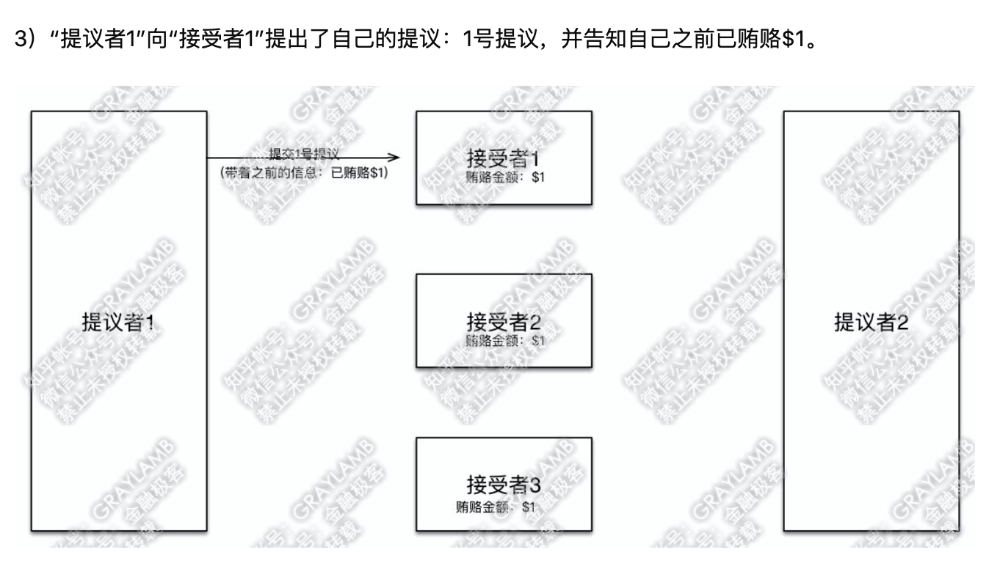
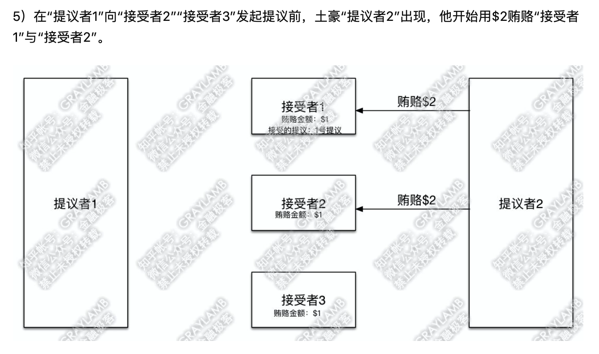

## 一、分布式理论

### 1.分布式系统概念

#### 1.1分布式系统特点

- 分布性

- 对等性（每个提供设备的服务器都是对等的，没有主从关系）

- 并发性

- 缺乏全局时钟

- 故障总是会发生

#### 1.2分布式系统发展


### 2.分布式系统面临的问题

- **通信异常**

网络本身的不可靠性，因此每次网络通信都会伴随着网络不可用的风险（光纤、路由、DNS等硬件设备或系统的不可用），都会导致最终**分布式系统无法顺利进行一次网络通信**，另外，即使分布式系统各节点之间的网络通信能够正常执行，其延时也会大于单机操作，存在巨大的延时差别，也会影响消息的收发过程，因此消息丢失和消息延迟变的非常普遍。

- **网络分区**

网络之间出现了网络不连通，但各个子网络的内部网络是正常的，从而导致整个系统的网络环境被切分成了若干个孤立的区域，**分布式系统就会出现局部小集群**，在极端情况下，这些小集群会独立完成原本需要整个分布式系统才能完成的功能，包括数据的事务处理，这就对分布式一致性提出非常大的挑战。

- **节点故障**

节点故障是分布式系统下另一个比较常见的问题，指的是组成分布式系统的服务器节点出现的宕机或"僵死"现象，根据经验来说，每个节点都有可能出现故障，并且经常发生. 

- **三态**

**分布式系统每一次请求与响应存在特有的”三态“概念，即成功、失败和超时。**分布式系统中，由于网络是不可靠的，虽然绝大部分情况下，网络通信能够接收到成功或失败的响应，但当网络出现异常的情况下，就会出现超时现象，通常有以下两种情况：

1. 由于网络原因，该请求并没有被成功的发送到接收方，而是在发送过程就发生了丢失现象。

2. 该请求成功的被接收方接收后，并进行了处理，但在响应反馈给发送方过程中，发生了消息丢失现象。


### 3.分布式一致性理论

> 分布式数据一致性，指的是数据在多份副本中存储时，各副本中的数据是一致的。
>
> **我们无法找到一种能够满足分布式系统所有系统属性的分布式一致性解决方案**。因此，如何既保证数据的一致性，同时又不影响系统运行的性能，是每一个分布式系统都需要重点考虑和权衡的

#### 3.1 一致性分类

- **强一致性**

  这种一致性级别是最符合用户直觉的，它要求系统写入什么，读出来的也会是什么，用户体验好，但实现起来往往对**系统的性能影响大**。强一致性很难实现。

- **弱一致性**

  这种一致性级别约束了系统在写入成功后，**不承诺立即可以读到写入的值**，也不承诺多久之后数据能够达到一致，但会**尽可能地保证**到某个时间级别（比如秒级别）后，数据能够达到一致状态。

  **最终一致性**

  	>最终一致性是所有分布式一致性模型当中最弱的。可以认为是没有任何优化的“最”弱一致性，它的意思是说，**我不考虑所有的中间状态的影响**，只保证当没有新的更新之后，经过一段时间之后，**最终系统内所有副本的数据是正确的**。 它最大程度上保证了系统的并发能力，也因此，在高并发的场景下，它也是使用**最广**的一致性模型。


### 4.CAP定理

>一个分布式系统不可能同时满足一致性（C:Consistency)，可用性（A: Availability）和分区容错性（P：Partition tolerance）这三个基本需求，**最多只能同时满足其中的2个。**


- C 一致性

> 指写操作后读操作可以读到最新的数据状态,当数据分布在多个节点上时,从任意节点读取到的数据都是最新的.
>
> **只考虑一致性实现：**
>
> 1. 写入主数据库后要数据同步到从数据库
>
> 2. 写入主数据库后,在向从数据库同步期间要将从数据库**锁定**, 等待同步完成后在释放锁,以免在写新数据后,向从数据库查询到旧的数据.
>
> **特点:**
>
> 1. 由于存在数据库同步过程,写操作的响应会有一定的延迟
>
> 2. 为了保定数据的一致性,**对资源暂时锁定**,待数据同步完成后释放锁定资源
>
> 3. 如果请求数据同步失败的节点则会返回错误信息, **一定不会**返回旧数据.


- A 可用性

>可用性是指任何操作都可以得到响应的结果,且不会出现响应超时或响应错误
>
>**只考虑可用性实现：**
>
>1. 写入主数据库后要将数据同步到从数据
>
>2. 由于要保证数据库的可用性,**不可以将数据库中资源锁定**
>
>3. 即使数据还没有同步过来,从数据库也要返回查询数据, **哪怕是旧数据,但不能返回错误和超时.**


- P 分区容错性

>分布式系统的各个节点部署在不同的子网中, 不可避免的会出现由于网络问题导致节点之间通信失败,此时**仍可以对外提供服务.**
>
>**实现：**
>
>1. 尽量使用异步取代同步操作,举例 使用异步方式将数据从主数据库同步到从数据库, 这样节点之间能有效的实现松耦合;
>
>2. 添加数据库节点,其中一个从节点挂掉,由其他从节点提供服务


### 5. *BASE* 理论

> 全称：Basically Available(基本可用)，Soft state（软状态）,和 Eventually consistent（最终一致性）三个短语的缩写， ebay 的架构师提出。
>
> BASE理论的核心思想是：**即使无法做到强一致性，但每个应用都可以根据自身业务特点，采用适当的方式来使系统达到最终一致性**。 


- **Basically Available(基本可用)**

> 基本可用是指分布式系统在出现不可预知故障的时候，允许损失部分可用性——但请注意，**这绝不等价于系统不可用**。
>
> 比如一下情况：
>
> **响应时间上的损失**：正常情况下，一个在线搜索引擎需要在0.5秒之内返回给用户相应的查询结果，但由于出现故障，查询结果的响应时间增加到了1~2秒。
>
> **功能上的损失**：当请求处理不过来的时候（比如抢票），降级到二级页面。比如“挤爆了，请等下再试”


- **Soft state（软状态）**

>相对于一致性，要求多个节点的数据副本都是一致的，这是一种 “**硬状态**”
>
>软状态指的是：允许系统中的数据存在中间状态，**并认为该状态不影响系统的整体可用性**，即**允许系统在多个不同节点的数据副本之间进行数据同步的过程中存在延迟。**


- **Eventually consistent（最终一致性）**

>最终一致性强调的是系统中所有的数据副本，在经过一段时间的同步后，最终能够达到一个一致的状态。因此最终一致性的本质是需要**系统保证最终数据能够达到一致，而不需要实时保证系统数据的强一致性。**


### 6.**Paxos**算法

​	Paxos 算法解决的是多个服务器之间对于一个问题需要有一个决策者，并且其他服务器无条件的按照决策者的决策执行。

​	提出提议的决策者的首要目的是为了让所有参与者的意见达成一致。为了这个目的，**第二决策者的意见可能会按照第一决策者的意见执行**。目的就是提议能超过**半数以上**的参与者通过。

假设有一组可以提出提案的进程集合，那么对于一个一致性算法**需要保证以下几点**：

>- 在这些被提出的提案中，只有一个会被选定
>- 如果没有提案被提出，就不应该有被选定的提案。
>- 当一个提案被选定后，那么所有进程都应该能学习（learn）到这个被选定的value

知乎https://www.zhihu.com/question/19787937 使用案例形象的说明这个算法的执行流程








### 7.RAFT算法

Raft将一致性算法分解成了3模块

1. 领导人选举

2. 日志复制

3. 安全性

Raft算法包括三种角色: Leader (领导者)、 Candidate (候选领导者)和 Follower (眼随 者)，决策前通过选举一个全局的 leader 来简化后续的决策过程 。 Leader 角色十分关键，决定日志 (log)的提交 。 日志只能由 Leader 向 Follower 单向复制 。

在Raft中，任何时候一个服务器都可以扮演下面的角色之一：

- 领导者(leader)：处理客户端交互，日志复制等动作，一般一次只有一个领导者

- 候选者(candidate)：候选者就是在选举过程中提名自己的实体，一旦选举成功，则成为领导者

- 跟随者(follower)：类似选民，完全被动的角色，这样的服务器等待被通知投票

而影响他们身份变化的则是 **选举**。

Raft使用心跳机制来触发选举。当server启动时，初始状态都是follower。每一个server都有一个定时器，超时时间为election timeout（一般为150-300ms），如果某server**没有超时的情况下收到来自领导者或者候选者的任何消息**，定时器重启，**如果超时**，它就开始发起一次选举。

典型的过程包括以下两个主要阶段:

- Leader 选举:开始所有节点都是 Follower，在随机超时发生后未收到来自 Leader 或Candidate 消息，则转变角色为 Candidate，提出选举请求 。 最近选举阶段( Term)中 得票超过一半者被选为 Leader;如果未选出，随机超时后进入新的阶段重试 。 Leader负责从客户端接收 log，并分发到其他节点;

- 同步日志: Leader 会找到系统中日志最新的记录，并强制所有的 Follower 来刷新到这个记录，数据的同步是单向的 
  

## 二、**分布式系统设计策略**

**分布式系统本质是通过低廉的硬件攒在一起以获得更好的吞吐量、性能以及可用性等。**

在分布式环境下，有几个问题是普遍关心的，我们称之为设计策略：

如何检测当前节点还活着？如何保障高可用？容错处理、负载均衡

### 1.心跳检测

心跳顾名思义，就是**以固定的频率向其他节点汇报当前节点状态的方式**。收到心跳，一般可以认为一个节点和现在的网络拓扑是良好的。当然，心跳汇报时，一般也会携带一些附加的状态、元数据信息，以便管理。

若Server没有收到node的心跳时，Server认为node失联。但是失联是失去联系，并不确定是否是node故障，有可能是node处于繁忙状态，导致调用检测超时；**也有可能是Server与node之间链路出现故障或闪断**。所以心跳不是万能的，**收到心跳可以确认节点正常，但是收不到心跳也不能认为该节点就已经宣告“死亡”。**此时，可以通过一些方法帮助Server做决定： **周期检测心跳机制、累计失效检测机制。**


### 2.高可用设计

系统高可用性的常用设计模式包括三种：**主备**（Master-SLave）、**互备**（Active-Active）和**集群**（Cluster）模式。

- **主备模式 主备模式就是Active-Standby模式，**

  > 当主机宕机时，备机接管主机的一切工作，待主机恢复正常后，按使用者的设定以自动（热备）或手动（冷备）方式将服务切换到主机上运行。在数据库部分，习惯称之为MS模式。MS模式即Master/Slave模式，这在数据库高可用性方案中比较常用，如MySQL、Redis等就采用MS模式实现主从复制。

- **互备模式** 

  > 互备模式指两台主机同时运行各自的服务工作且相互监测情况。在数据库高可用部分，常见的互备是MM模式。MM模式即Multi-Master模式，指一个系统存在多个master，每个master都具有read-write能力，会根据时间戳或业务逻辑合并版本。

- **集群模式**

  >集群模式是指有多个节点在运行，**同时可以通过主控节点分担服务请求**。如Zookeeper。集群模式需要解决主控节点本身的高可用问题，一般采用主备模式。


### 3.容错性

​	容错顾名思义就是IT系统对于错误包容的能力。容错的处理是保障分布式环境下相应系统的高可用或者健壮性，一个典型的案例就是对于**缓存穿透** 

- **缓存穿透**问题

> 描述：
>
> 我们在项目中使用缓存通常都是先检查缓存中是否存在，如果存在直接返回缓存内容，如果不存在就直接查询数据库然后再缓存查询结果返回。这个时候如果我们查询的某一个数据在缓存中一直不存在，就会造成每一次请求都查询DB，这样缓存就失去了意义，在流量大时，或者有人恶意攻击。如频繁发起为id为“-1”的条件进行查询，可能DB就挂掉了。

>其中一个解决方案：
>
>一个比较巧妙的方法是，可以将这个不存在的key预先设定一个值。比如，key=“null”。在返回这个null值的时候，我们的应用就可以认为这是不存在的key，那我们的应用就可以决定是否继续等待访问，还是放弃掉这次操作。如果继续等待访问，过一个时间轮询点后，再次请求这个key，如果取到的值不再是null，则可以认为这时候key有值了，从而避免了透传到数据库，把大量的类似请求挡在了缓存之中。


- **缓存击穿（不同与缓存穿透）**

缓存击穿，是指一个key非常热点，在不停的扛着大并发，大并发集中对这一个点进行访问，**当这个key在失效的瞬间，持续的大并发就穿破缓存**，直接请求数据库，就像在一个屏障上凿开了一个洞。


- **缓存雪崩**

缓存层出现了错误，不能正常工作了。于是所有的请求都会达到存储层，存储层的调用量会暴增，造成存储层也会挂掉的情况。


**解决方案：**

>- **redis高可用**
>
>这个思想的含义是，既然redis有可能挂掉，那我多增设几台redis，这样一台挂掉之后其他的还可以继续工作，其实就是搭建的集群。
>
>- **限流降级**
>
>这个解决方案的思想是，在缓存失效后，通过加锁或者队列来控制读数据库写缓存的线程数量。比如对某个key只允许一个线程查询数据和写缓存，其他线程待。
>
>- **数据预热**
>
>数据加热的含义就是在正式部署之前，我先把可能的数据先预先访问一遍，这样部分可能大量访问的数据就会加载到缓存中。在即将发生大并发访问前手动触发加载缓存不同的key，设置不同的过期时间，让缓存失效的时间点尽量均匀。


### 4.**负载均衡**

其关键在于使用多台集群服务器共同**分担**计算任务，把网络请求及计算分配到集群可用的不同服务器节点上，从而达到高可用性及较好的用户操作体验。

负载均衡器有硬件解决方案，也有软件解决方案。硬件解决方案有著名的F5，软件有LVS、HAProxy、Nginx等。

- 轮询：即Round Robin，根据Nginx配置文件中的顺序，依次把客户端的Web请求分发到不同的后端服务器。

- 最少连接：当前谁连接最少，分发给谁。

- IP地址哈希：确定相同IP请求可以转发给同一个后端节点处理，以方便session保持。

- 基于权重的负载均衡：配置Nginx把请求更多地分发到高配置的后端服务器上，把相对较少的请求分发到低配服务器。


## 三、**分布式架构网络通信**

在分布式服务框架中，**一个最基础的问题就是远程服务是怎么通讯的**，在Java领域中有很多可实现远程通讯的技术，例如：RMI、Hessian、SOAP、ESB和JMS等.

### 1.基本原理

要实现网络机器间的通讯，首先得来看看计算机系统网络通信的基本原理，在底层层面去看，网络通信需要做的就是将流从一台计算机传输到另外一台计算机，基于传输协议和网络IO来实现，其中传输协议比较出名的有**tcp、udp**等等，tcp、udp都是在**基于Socket概念上**为某类应用场景而扩展出的传输协议，**网络IO，主要有bio、nio、aio三种方式**，所有的分布式应用通讯都基于这个原理而实现，只是为了应用的易用，各种语言通常都会提供一些更为贴近应用易用的应用层协议。


### **2.RPC**

RPC全称为remote procedure call，即**远程过程调用**。

借助RPC可以做到像本地调用一样调用远程服务，是一种进程间的通信方式比如两台服务器A和B，A服务器上部署一个应用，B服务器上部署一个应用，A服务器上的应用想调用B服务器上的应用提供的方法，由于两个应用不在一个内存空间，**不能直接调用，所以需要通过网络来表达调用的语义和传达调用的数据。**

**需要注意的是RPC并不是一个具体的技术，而是指整个网络远程调用过程。**

一个完整的RPC架构里面包含了**四个核心**的组件，分别是Client，Client Stub，Server以及Server Stub，这个Stub可以理解为存根。

- 客户端(Client)，服务的调用方。

- 客户端存根(Client Stub)，存放服务端的地址消息，再将客户端的请求参数打包成网络消息，然后通过网络远程发送给服务方。

- 服务端(Server)，真正的服务提供者。

- 服务端存根(Server Stub)，接收客户端发送过来的消息，将消息解包，并调用本地的方法。


在java中RPC框架比较多，常见的有Hessian、gRPC、Thrift、HSF (High Speed Service Framework)、Dubbo等，其实对 于RPC框架而言，**核心模块 就是通讯和序列化**


### 3.RMI

Java RMI 指的是远程方法调用 (Remote Method Invocation),**是java原生支持的远程调用** ,采用JRMP（JavaRemote Messageing protocol）作为通信协议，可以认为是**纯java版本的分布式远程调用解决方案**， RMI主要用于不同虚拟机之间的通信，这些虚拟机可以在不同的主机上、也可以在同一个主机上，这里的通信可以理解为一个虚拟机上的对象调用另一个虚拟机上对象的方法。

**服务器端开发代码**：

1. 定义远程调用接口(远程服务对象接口必须继承Remote接口；同时方法必须抛出RemoteExceptino异常)

```java
import java.rmi.Remote; 
import java.rmi.RemoteException; 

/** * 远程服务对象接口必须继承Remote接口；同时方法必须抛出RemoteExceptino异常 */
public interface Hello extends Remote {
  public String sayHello(User user) throws RemoteException; 
}
```

2. 实现远程服务对象(必须继承UnicastRemoteObject或其子类)

```java
import java.rmi.RemoteException; 
import java.rmi.server.UnicastRemoteObject; 
/** * 远程服务对象实现类写在服务端；必须继承UnicastRemoteObject或其子类 **/ 
public class HelloImpl extends UnicastRemoteObject implements Hello { 
  /** 
  * 因为UnicastRemoteObject的构造方法抛出了RemoteException异常，
  	因此这里默认的构造方法必须写，
  	必须 声明抛出RemoteException异常 ** @throws RemoteException 
  */ 
 	  private static final long serialVersionUID = 3638546195897885959L; 
  
    protected HelloImpl() throws RemoteException { 
      super(); 
    }
    @Override 
    public String sayHello(User user) throws RemoteException { 
      System.out.println("this is server, hello:" + user.getName()); return "success"; 
  	} 
 }
```

3. 绑定服务

```java
public class Server {

  public static void main(String[] args) { 
    try {
      // 创建一个远程对象，同时也会创建stub对象、skeleton对象 
      Hello hello = new HelloImpl();
      //本地主机上的远程对象注册表Registry的实例，并指定端口为8888，这一步必不可少（Java默认端	口 是1099），必不可缺的一步，缺少注册表创建，则无法绑定对				象到远程注册表上
      LocateRegistry.createRegistry(8080);
      try {
        Naming.bind("//127.0.0.1:8080/zm", hello);
        } catch (MalformedURLException e){ 
        e.printStackTrace(); 
      }
      System.out.println("service bind already!!");
      } catch (RemoteException e) {
      e.printStackTrace(); 
    }
  }
}
```


客户端开发代码：

```java
public class Client { 
  public static void main(String[] args) { 
    try {
      //在RMI服务注册表中查找名称为RHello的对象，并调用其上的方法
      Hello hello = (Hello) Naming.lookup("//127.0.0.1:8080/zm");
      User user = new User(); 
      user.setName("james");
      System.out.println(hello.sayHello(user)); 
    } catch (MalformedURLException e) {
      e.printStackTrace();
    } catch (RemoteException e) {
      e.printStackTrace();
    }catch (NotBoundException e) {
      e.printStackTrace(); 
    } 
  }
```


### 4.BIO、NIO、AIO


**BIO 同步阻塞IO**

> 服务器实现模式为**一个连接一个线程**，即客户端有连接请求时服务器端就需要启动一个线程进行处理，如果这个连接不做任何事情会造成不必要的线程开销，当然**可以通过线程池机制改善**。
>
> Java1.4之前唯一的选择，**简单易用但资源开销太高**


**NIO同步非阻塞IO**

同步非阻塞IO （non-blocking IO / new io）是指JDK 1.4 及以上版本。

当一个连接创建后，**不会需要对应一个线程**，这个连接会被注册到多路复用器，所以一个连接只需要一个线程即可，所有的连接需要一个线程就可以操作，该线程的多路复用器会轮训，**发现连接有请求时，才开启一个线程处理。**

> 服务器实现模式为一个请求一个通道，即客户端发送的连接请求都会注册到**多路复用器**上，多路复用器轮询到连接**有IO请求时**才启动一个线程进行处理。

- **通道（Channels)**

> NIO 新引入的最重要的抽象是通道的概念。Channel 数据连接的通道。 数据可以从Channel读到Buffffer中，也可以从Buffffer 写到Channel中 .

- **缓冲区（Buffffers）**

> 通道channel可以向缓冲区Buffffer中写数据，也可以像buffffer中存数据。

- **选择器（Selector）**

> 使用选择器，借助单一线程，就可对数量庞大的活动 I/O 通道实时监控和维护。


**AIO 异步非阻塞IO**

>当有流可以读时,操作系统会将可以读的流传入read方法的缓冲区,**并通知应用程序**,对于写操作,OS将write方法的流写入完毕是操作系统会主动通知应用程序。**因此read和write都是异步** 的，完成后会调用**回调函数**。
>
>使用场景：连接数目多且连接比较长（重操作）的架构，比如相册服务器。重点调用了OS参与并发操作，编程比较复杂。Java7开始支持


## 四、Netty

Netty 是由 JBOSS 提供一个**异步的**、 **基于事件驱动**的网络编程框架。

Netty 可以帮助你快速、 简单的开发出一 个网络应用， 相当于**简化和流程化了 NIO 的开发过程**。

### **1.Netty主要组件**


### 2. Netty和Tomcat有什么区别

Netty和Tomcat最大的区别就在于**通信协议**，Tomcat是基于Http协议的，他的实质是一个**基于http协议的web容器**，但是Netty不一样，他能通过编程**自定义各种协议**，**因为netty能够通过codec自己来编码/解码字节流**，完成类似redis访问的功能，这就是netty和tomcat最大的不同。

*有人说netty的性能就一定比tomcat性能高，其实不然，tomcat从6.x开始就支持了nio模式，并且后续还有APR模式——一种通过jni调用apache网络库的模式，相比于旧的bio模式，并发性能得到了很大提高，特别是APR模式，而netty是否比tomcat性能更高，则要取决于netty程序作者的技术实力了。*


**NIO和BIO区别回顾**

> 当一个连接建立之后，他有两个步骤要做，
>
> 第一步是接收完客户端发过来的全部数据，
>
> 第二步是服务端处理完请求业务之后返回response给客户端。
>
> NIO和BIO的区别主要是在**第一步**。 在BIO中，等待客户端发数据这个过程是**阻塞**的，**这样就造成了一个线程只能处理一个请求的情况**，而机器能支持的最大线程数是有限的，这就是为什么BIO不能支持高并发的原因。而NIO中，当一个Socket建立好之后，Thread并不会阻塞去接受这个Socket，**而是将这个请求交给Selector**，Selector会不断的去**遍历所有的Socket**，一旦有一个Socket建立完成，他会通知Thread，然后Thread处理完数据再返回给客户端——**这个过程是不阻塞的**，这样就能让一个Thread处理更多的请求了。


**IO类型分类**

- BIO，同步阻塞IO，阻塞整个步骤，如果连接少，他的延迟是最低的，因为一个线程只处理一个连接，**适用于少连接且延迟低的场景，比如说数据库连接**。

- NIO，同步非阻塞IO，阻塞业务处理但不阻塞数据接收，**适用于高并发且处理简单的场景**，比如聊天软件。

- 多路复用IO，他的两个步骤处理是分开的，也就是说，**一个连接可能他的数据接收是线程a完成的，数据处理是线程b完成的**，他比BIO能处理更多请求。

- 信号驱动IO，这种IO模型主要用在嵌入式开发，不参与讨论。

- 异步IO，他的数据请求和数据处理都是异步的，数据请求一次返回一次，**适用于长连接的业务场景**。


### **3.Netty 请求处理流程**

#### 3.1 Channel


- Channel，**表示一个连接，可以理解为每一个请求**，就是一个Channel

- **ChannelHandler**，***核心处理业务就在这里***，用于处理业务请求。

- ChannelHandlerContext，用于传输**业务数据**。
- ChannelPipeline(连接管道) ，用于保存处理过程需要用到的ChannelHandler和ChannelHandlerContext。


#### 3.2 ByteBuf

ByteBuf是一个存储字节的容器，最大特点就是**使用方便**，它既有自己的**读索引**和**写索引**，方便你对整段字节缓存进行读写，也支持get/set，方便你对其中每一个字节进行读写，他的数据结构如下图所示：


**ByteBuf有三种使用模式：**

>- Heap Buffer 堆缓冲区
>
>  堆缓冲区是ByteBuf最常用的模式，他将数据存储在堆空间。
>
>- Direct Buffer 直接缓冲区
>
>  直接缓冲区是ByteBuf的另外一种常用模式，**他的内存分配都不发生在堆**，jdk1.4引入的nio的ByteBuffer类允许jvm通过本地方法调用分配内存，这样做有两个好处:
>
>  - 通过免去中间交换的内存拷贝, 提升IO处理速度; 直接缓冲区的内容可以驻留在垃圾回收扫描的堆区以外。
>
>  - DirectBuffer 在 -XX:MaxDirectMemorySize=xxM大小限制下, 使用 Heap 之外的内存, GC对此”无能为力”,也就意味着规避了在高负载下频繁的GC过程对应用线程的中断影响
>
>- Composite Buffer 复合缓冲区
>
>  复合缓冲区相当于多个不同ByteBuf的视图，这是netty提供的，jdk不提供这样的功能。


#### 3.3 Codec

Netty中的编码/解码器，**通过他你能完成字节与pojo、pojo与pojo的相互转换**，从而达到**自定义协议**的目的。在Netty里面最有名的就是**HttpRequestDecoder**和**HttpResponseEncoder**了。


### 4.动手搭建HttpServer

#### 4.1.认识Http请求


1. HTTP Request,Response第一部分是包含的头信息

2. HttpContent 里面包含的是数据，可以后续有多个 HttpContent 部分

3. LastHttpContent 标记是 HTTP request,response 的结束，同时可能包含头的尾部信息

4. 完整的 HTTP request,response，由1，2，3组成


> 一次http请求并不是通过一次对话完成的，**他中间可能有很次的连接**。通过上一章我们队netty的了解，每一次对话都会建立一个channel，并且**一个ChannelInboundHandler一般是不会同时去处理多个Channel的**。如何在一个Channel里面处理一次完整的Http请求？这就要用到我们上图提到的FullHttpRequest，我们只需要在使用netty处理channel的时候，**只处理消息是FullHttpRequest的Channel**，这样我们就能在一个ChannelHandler中处理一个完整的Http请求了。

#### 4.2 开始搭建

- **服务器端代码**

```java
package com.dz.netty.http;

import io.netty.bootstrap.ServerBootstrap;
import io.netty.channel.ChannelInitializer;
import io.netty.channel.ChannelOption;
import io.netty.channel.nio.NioEventLoopGroup;
import io.netty.channel.socket.SocketChannel;
import io.netty.channel.socket.nio.NioServerSocketChannel;
import io.netty.handler.codec.http.HttpObjectAggregator;
import io.netty.handler.codec.http.HttpRequestDecoder;
import io.netty.handler.codec.http.HttpResponseEncoder;

/**
 * Created by RoyDeng on 17/7/20.
 */
public class HttpServer {

    private final int port;

    public HttpServer(int port) {
        this.port = port;
    }

    public static void main(String[] args) throws Exception {
        if (args.length != 1) {
            System.err.println(
                    "Usage: " + HttpServer.class.getSimpleName() +
                            " <port>");
            return;
        }
        int port = Integer.parseInt(args[0]);
        new HttpServer(port).start();
    }

    public void start() throws Exception {
        ServerBootstrap b = new ServerBootstrap();
        NioEventLoopGroup group = new NioEventLoopGroup();
        b.group(group)
                .channel(NioServerSocketChannel.class)
                .childHandler(new ChannelInitializer<SocketChannel>() {
                    @Override
                    public void initChannel(SocketChannel ch)
                            throws Exception {
                        System.out.println("initChannel ch:" + ch);
                        ch.pipeline()
                                .addLast("decoder", new HttpRequestDecoder())   // 1
                                .addLast("encoder", new HttpResponseEncoder())  // 2
                                .addLast("aggregator", new HttpObjectAggregator(512 * 1024))    // 3
                                .addLast("handler", new HttpHandler());        // 4
                    }
                })
                .option(ChannelOption.SO_BACKLOG, 128) // determining the number of connections queued
                .childOption(ChannelOption.SO_KEEPALIVE, Boolean.TRUE);

        b.bind(port).sync();
    }
}
```

1. HttpRequestDecoder，用于解码request

2. HttpResponseEncoder，用于编码response

3. **aggregator**，消息聚合器（重要）。为什么能有FullHttpRequest这个东西，就是因为有他，HttpObjectAggregator，如果没有他，就不会有那个消息是FullHttpRequest的那段Channel，同样也不会有FullHttpResponse。HttpObjectAggregator(512 * 1024)的参数含义是消息合并的数据大小，如此代表聚合的消息内容长度不超过512kb。

4. 添加我们自己的处理接口

**自定义的业务处理类**

```java
package com.dz.netty.http;

import io.netty.buffer.Unpooled;
import io.netty.channel.ChannelHandlerContext;
import io.netty.channel.SimpleChannelInboundHandler;
import io.netty.handler.codec.http.*;
import io.netty.util.AsciiString;

/**
 * Created by RoyDeng on 17/7/20.
 */
public class HttpHandler extends SimpleChannelInboundHandler<FullHttpRequest> { // 1

    private AsciiString contentType = HttpHeaderValues.TEXT_PLAIN;

    @Override
    protected void channelRead0(ChannelHandlerContext ctx, FullHttpRequest msg) throws Exception {
        System.out.println("class:" + msg.getClass().getName());
        DefaultFullHttpResponse response = new DefaultFullHttpResponse(HttpVersion.HTTP_1_1,
                HttpResponseStatus.OK,
                Unpooled.wrappedBuffer("test".getBytes())); // 2

        HttpHeaders heads = response.headers();
        heads.add(HttpHeaderNames.CONTENT_TYPE, contentType + "; charset=UTF-8");
        heads.add(HttpHeaderNames.CONTENT_LENGTH, response.content().readableBytes()); // 3
        heads.add(HttpHeaderNames.CONNECTION, HttpHeaderValues.KEEP_ALIVE);

        ctx.write(response);
    }

    @Override
    public void channelReadComplete(ChannelHandlerContext ctx) throws Exception {
        System.out.println("channelReadComplete");
        super.channelReadComplete(ctx);
        ctx.flush(); // 4
    }

    @Override
    public void exceptionCaught(ChannelHandlerContext ctx, Throwable cause) throws Exception {
        System.out.println("exceptionCaught");
        if(null != cause) cause.printStackTrace();
        if(null != ctx) ctx.close();
    }
}
```

该段代码需要注意的地方如注释所示，有以下四点：

1.  Handler需要声明泛型为<FullHttpRequest>，声明之后，只有msg为FullHttpRequest的消息才能进来. 由于泛型的过滤比较简单，我们就不改代码来验证了，但是在这里我们可以利用泛型的特性另外做个小测试，将泛型去掉，并且将HttpServer中`.addLast("aggregator", new HttpObjectAggregator(512 * 1024)) // 3`这一行代码注释掉，然后观察注释前后的log。
    **注释前：**

    ```text
   initChannel ch:[id: 0xcb9d8e9e, L:/0:0:0:0:0:0:0:1:8888 - R:/0:0:0:0:0:0:0:1:58855]
   class:io.netty.handler.codec.http.HttpObjectAggregator$AggregatedFullHttpRequest
   channelReadComplete
    ```

   **注释后：**

   ```text
   initChannel ch:[id: 0xc5415409, L:/0:0:0:0:0:0:0:1:8888 - R:/0:0:0:0:0:0:0:1:58567]
   class:io.netty.handler.codec.http.DefaultHttpRequest
   class:io.netty.handler.codec.http.LastHttpContent$1
   channelReadComplete
   channelReadComplete
   ```

   2. 从中可以看出，如果没有aggregator，**那么一个http请求就会通过多个Channel被处理**，这对我们的业务开发是不方便的，而aggregator的作用就在于此。

   3. 生成response，这里使用的FullHttpResponse，同FullHttpRequest类似，通过这个我们就不用将response拆分成多个channel返回给请求端了。

      添加header描述length。这一步是很重要的一步，如果没有这一步，你会发现用postman发出请求之后就一直在刷新，因为http请求方不知道返回的数据到底有多长。

   4. channel读取完成之后需要输出缓冲流。如果没有这一步，**你会发现postman同样会一直在刷新。**

   

   **构建HTTPS服务**

   netty有提供SSL加密的工具包，只需要通过添加SslHandler，就能快速搭建。基于上面的代码，我们重新定义一个ChannelInitializer。

   ```java
   public class SSLChannelInitializer extends ChannelInitializer<SocketChannel> {
   
       private final SslContext sslContext;
   
       public SSLChannelInitializer() {
           String keyStoreFilePath = "/root/.ssl/test.pkcs12";
           String keyStorePassword = "Password@123";
   
           try {
               KeyStore keyStore = KeyStore.getInstance("PKCS12");
               keyStore.load(new FileInputStream(keyStoreFilePath), keyStorePassword.toCharArray());
   
               KeyManagerFactory keyManagerFactory = KeyManagerFactory.getInstance(KeyManagerFactory.getDefaultAlgorithm());
               keyManagerFactory.init(keyStore, keyStorePassword.toCharArray());
   
               sslContext = SslContextBuilder.forServer(keyManagerFactory).build();
           } catch (Exception e) {
               throw new RuntimeException(e);
           }
       }
   
       @Override
       protected void initChannel(SocketChannel ch) {
           ChannelPipeline pipeline = ch.pipeline();
           SSLEngine sslEngine = sslContext.newEngine(ch.alloc());
           pipeline
                   .addLast(new SslHandler(sslEngine))
                     .addLast("decoder", new HttpRequestDecoder())
                     .addLast("encoder", new HttpResponseEncoder())
                     .addLast("aggregator", new HttpObjectAggregator(512 * 1024))
                     .addLast("handler", new HttpHandler());
           ;
       }
   }
   ```

   

### 5. Decoder和Encoder

#### 5.1 什么是Decoder和Encoder

就是**ChannelInboundHandler和ChannelOutboundHandler**，分别用于在数据流**进来的时候将字节码转换为消息对象**和**数据流出去的时候将消息对象转换为字节码**。

- **Encoder**

>Encoder最重要的实现类是MessageToByteEncoder<T>，这个类的作用就是将**消息实体T从对象转换成byte，**写入到ByteBuf，然后再丢给剩下的ChannelOutboundHandler传给客户端.
>
>encode方法是继承MessageToByteEncoder唯一需要重写的方法

- **Decoder**

>和Encoder一样，decoder就是在服务端收到数据的时候，将字节流转换为实体对象Message。但是和Encoder的处理逻辑不一样，数据传到服务端有可能不是一次请求就能完成的，中间可能需要经过几次数据传输，并且每一次传输传多少数据也是不确定的,所以它有**两个重要方法**decode和decodeLast：

```java
public class ToIntegerDecoder extends ByteToMessageDecoder {  //1

    @Override
    public void decode(ChannelHandlerContext ctx, ByteBuf in, List<Object> out)
            throws Exception {
        if (in.readableBytes() >= 4) {  //2
            out.add(in.readInt());  //3
        }
    }
}
```

   从这段代码可以看出，因为不知道这次请求发过来多少数据，**所以每次都要判断byte长度够不够4，如果你的数据长度更长**，且不固定的话，这里的逻辑会变得非常复杂。所以在这里介绍另一个我们常用的解码器 ：ReplayingDecoder。

- **ReplayingDecoder**

     ReplayingDecoder 是 byte-to-message 解码的一种特殊的抽象基类，读取缓冲区的数据之前需要检查缓冲区是否有足够的字节，使用ReplayingDecoder就无需自己检查；若ByteBuf中有足够的字节，则会正常读取；**若没有足够的字节则会停止解码**。

RelayingDecoder在使用的时候需要搞清楚的两个方法是checkpoint(S s)和state()，其中checkpoint的参数S，代表的是ReplayingDecoder所处的状态，**一般是枚举类型**。RelayingDecoder是一个有状态的Handler，状态表示的是它目前读取到了哪一步，**checkpoint(S s)是设置当前的状态，state()是获取当前的状态**。


### 6.如何实现长连接

一个简单的长连接demo分为以下几个步骤：


1. 创建连接（Channel）

2. 发心跳包

3. 发消息，并通知其他用户

4. 一段时间没收到心跳包或者用户主动关闭之后关闭连接

   

   **看似简单的步骤，里面有两个技术难点：**

1. 如何保存已创建的Channel

   这里我们是将Channel放在一个Map中，以Channel.hashCode()作为key

   > 其实这样做有一个劣势，就是不适合水平扩展，每个机器都有一个连接数的上线，如果需要实现多用户实时在线，对机器的数量要求会很高，在这里我们不多做讨论，不同的业务场景，设计方案也是不同的，可以在长连接方案和客户端轮询方案中进行选择。

2. 如何自动关闭没有心跳的连接

   Netty有一个比较好的Feature，就是ScheduledFuture，他可以通过ChannelHandlerContext.executor().schedule()创建，支持延时提交，也支持取消任务，这就给我们心跳包的自动关闭提供了一个很好的实现方案。


ChannelHandler了，代码如下：

```java
package com.dz.netty.live;

import io.netty.channel.Channel;
import io.netty.channel.ChannelHandlerContext;
import io.netty.channel.SimpleChannelInboundHandler;
import io.netty.util.concurrent.ScheduledFuture;
import org.slf4j.Logger;
import org.slf4j.LoggerFactory;

import java.util.HashMap;
import java.util.Map;
import java.util.concurrent.TimeUnit;

/**
 * Created by RoyDeng on 17/7/20.
 */
public class LiveHandler extends SimpleChannelInboundHandler<LiveMessage> { // 1

    private static Map<Integer, LiveChannelCache> channelCache = new HashMap<>();
    private Logger logger = LoggerFactory.getLogger(LiveHandler.class);

    @Override
    protected void channelRead0(ChannelHandlerContext ctx, LiveMessage msg) throws Exception {
        Channel channel = ctx.channel();
        final int hashCode = channel.hashCode();
        System.out.println("channel hashCode:" + hashCode + " msg:" + msg + " cache:" + channelCache.size());

        if (!channelCache.containsKey(hashCode)) {
            System.out.println("channelCache.containsKey(hashCode), put key:" + hashCode);
            channel.closeFuture().addListener(future -> {
                System.out.println("channel close, remove key:" + hashCode);
                channelCache.remove(hashCode);
            });
            ScheduledFuture scheduledFuture = ctx.executor().schedule(
                    () -> {
                        System.out.println("schedule runs, close channel:" + hashCode);
                        channel.close();
                    }, 10, TimeUnit.SECONDS);
            channelCache.put(hashCode, new LiveChannelCache(channel, scheduledFuture));
        }

        switch (msg.getType()) {
            case LiveMessage.TYPE_HEART: {
                LiveChannelCache cache = channelCache.get(hashCode);
                ScheduledFuture scheduledFuture = ctx.executor().schedule(
                        () -> channel.close(), 5, TimeUnit.SECONDS);
                cache.getScheduledFuture().cancel(true);
                cache.setScheduledFuture(scheduledFuture);
                ctx.channel().writeAndFlush(msg);
                break;
            }
            case LiveMessage.TYPE_MESSAGE: {
                channelCache.entrySet().stream().forEach(entry -> {
                    Channel otherChannel = entry.getValue().getChannel();
                    otherChannel.writeAndFlush(msg);
                });
                break;
            }
        }
    }

    @Override
    public void channelReadComplete(ChannelHandlerContext ctx) throws Exception {
        logger.debug("channelReadComplete");
        super.channelReadComplete(ctx);
    }

    @Override
    public void exceptionCaught(ChannelHandlerContext ctx, Throwable cause) throws Exception {
        logger.debug("exceptionCaught");
        if(null != cause) cause.printStackTrace();
        if(null != ctx) ctx.close();
    }
}

```


客户端代码（使用socket实现长链接）

```java
package com.dz.test;

import org.slf4j.Logger;
import org.slf4j.LoggerFactory;

import java.io.IOException;
import java.net.InetSocketAddress;
import java.net.Socket;
import java.nio.ByteBuffer;
import java.util.Scanner;

/**
 * Created by RoyDeng on 18/2/3.
 */
public class LongConnTest {

    private Logger logger = LoggerFactory.getLogger(LongConnTest.class);

    String host = "localhost";
    int port = 8080;

    public void testLongConn() throws Exception {
        logger.debug("start");
        final Socket socket = new Socket();
        socket.connect(new InetSocketAddress(host, port));
        Scanner scanner = new Scanner(System.in);
        new Thread(() -> {
            while (true) {
                try {
                    byte[] input = new byte[64];
                    int readByte = socket.getInputStream().read(input);
                    logger.debug("readByte " + readByte);
                } catch (IOException e) {
                    e.printStackTrace();
                }
            }
        }).start();
        int code;
        while (true) {
            code = scanner.nextInt();
            logger.debug("input code:" + code);
            if (code == 0) {
                break;
            } else if (code == 1) {
                ByteBuffer byteBuffer = ByteBuffer.allocate(5);
                byteBuffer.put((byte) 1);
                byteBuffer.putInt(0);
                socket.getOutputStream().write(byteBuffer.array());
                logger.debug("write heart finish!");
            } else if (code == 2) {
                byte[] content = ("hello, I'm" + hashCode()).getBytes();
                ByteBuffer byteBuffer = ByteBuffer.allocate(content.length + 5);
                byteBuffer.put((byte) 2);
                byteBuffer.putInt(content.length);
                byteBuffer.put(content);
                socket.getOutputStream().write(byteBuffer.array());
                logger.debug("write content finish!");
            }
        }
        socket.close();
    }

    // 因为Junit不支持用户输入,所以用main的方式来执行用例
    public static void main(String[] args) throws Exception {
        new LongConnTest().testLongConn();
    }
}
```


